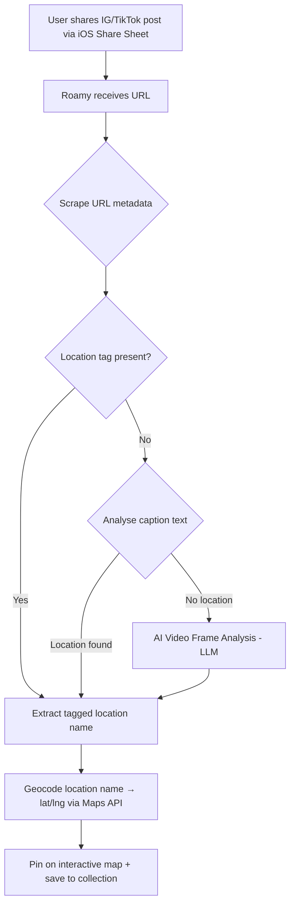

# Roamy Travel vs AVARA — Deep Research Report

## 1. Roamy Travel — Overview

| Detail | Info |
|---|---|
| **Full Name** | Roamy: Save Spot & Plan Trips |
| **Developer** | LOGOS STUDIO INC. (Toronto, Canada) |
| **Parent Company** | Published via MWM ecosystem |
| **App Store** | [iOS App Store](https://apps.apple.com/ca/app/roamy-spots-trip-planner/id6748781672) |
| **Rating** | 4.7 ★ (438 ratings) |
| **Size** | 174.8 MB |
| **Requires** | iOS 18.0+ (iPhone only) |
| **Android** | Pre-order available, not yet launched |
| **Category** | Travel |
| **Launched** | ~October 2025 |
| **Latest Version** | 1.2.3 (March 2026) |

---

## 2. Roamy — Tech Stack & Frameworks

### Frontend (Mobile)
- **Native Swift (iOS)** — LOGOS STUDIO builds native iOS apps. The iOS 18.0 minimum requirement and 174.8 MB size are consistent with a native SwiftUI / UIKit app.
- **MWM AI Platform** — MWM's own platform generates production-ready native Swift code from prompts, leveraging native Apple APIs (Widgets, Dynamic Island, HealthKit, ARKit, etc.). Roamy was likely built or prototyped using this pipeline.
- **No React Native / Flutter evidence** — The app is iPhone-only with no cross-platform signals.

### Backend / AI
- **AI-powered itinerary generation** — Uses AI (likely LLM-based) to create optimised day-by-day travel routes.
- **Location extraction pipeline** using a multi-step approach (details in section 3).
- **Google accounts authentication** supported (added in v1.0.2).

### Map Integration
- **Interactive map view** — All saved spots displayed on a visual, interactive map.
- **Geocoding API** — Likely Google Maps Platform (Google Places / Geocoding API) to convert location names → lat/lng coordinates.
- **Route optimisation** — "One tap route optimisation" (v1.1.9) reorders daily spots for shortest travel time, suggesting integration with a **Directions/Distance Matrix API** (Google Maps or Apple MapKit).
- **Public transit data** — v1.1.9 added "more accurate arrival times" for public transportation, indicating integration with **Google Transit / GTFS data**.
- **Map filtering** — v1.0.5 added search and filter functionality on the map layer.

> [!NOTE]
> Roamy never explicitly names its map provider, but the combination of geocoding, route optimisation, and public transit data strongly points to **Google Maps Platform** as the primary map service.

---

## 3. Roamy — How They Get Data (Location Extraction Pipeline)

Roamy's core innovation is converting social media saves into mapped travel spots. Here's the pipeline:

### Step-by-step:
1. **Share Sheet integration** — User shares an Instagram/TikTok post URL directly to Roamy using the native iOS share extension ("1-tap save").
2. **URL scraping** — App fetches the post page and extracts Open Graph metadata, captions, and location tags.
3. **Explicit location tags** — If the post has a geo-tag (Instagram location tag), Roamy extracts it directly.
4. **Caption NLP** — If no geo-tag, the app analyses the caption text using NLP to identify place names.
5. **AI video analysis (fallback)** — As a last resort, Roamy uses an LLM to scan video frames and infer locations from visual cues.
6. **Geocoding** — The extracted location name is sent to a geocoding API (likely Google Maps) to get coordinates.
7. **Map pinning** — The spot is placed on the interactive map and added to the user's collection.

### Additional data sources:
- **Community suggestions** — v1.1.7 added "community's favourite locations" as suggested spots during trip planning.
- **Screenshots / notes** — Users can also import from screenshots and text notes (presumably using OCR + NLP).

---

## 4. Roamy — Key Features Timeline

| Version | Feature |
|---|---|
| 1.0.0 | Core: import from IG/TikTok, interactive map, trip planner |
| 1.0.2 | Google account login |
| 1.0.5 | Map filtering and search |
| 1.1.7 | Community-suggested locations |
| 1.1.9 | One-tap route optimisation, public transit accuracy |
| 1.2.0 | Shared trips — group collaboration |

---

## 5. AVARA (Your App) — Current State

| Detail | Info |
|---|---|
| **Framework** | React Native (Expo SDK 54) |
| **Language** | JavaScript |
| **Backend** | Supabase |
| **Animation** | react-native-reanimated 4.1.1 + react-native-gesture-handler |
| **Navigation** | @react-navigation (bottom-tabs + native-stack) |
| **Auth** | Custom AuthContext (Supabase-backed) |
| **Data** | Static mock data (3000 recommendations, 400 discover profiles, 100 cities) |
| **Size** | Currently local/dev stage |

### Key Screens
| Screen | Purpose |
|---|---|
| `TripsScreen` | Current trip card, AI itinerary timeline, saved picks |
| `ExploreScreen` | Bumble-style swipe cards for travellers/locals |
| `ExploreSwipeScreen` | Recommendation card swiping (cuisine/experience/stays) |
| `ChatScreen` | Messaging with matches |
| `MatchesScreen` | Matched connections list |
| `ProfileSetupScreen` | Onboarding profile creation |
| `EditProfileScreen` | Edit profile (photos, bio, interests) |

### Data Architecture
- `recommendations.js` — 3000 geo-tagged recommendations (100 cities × 30 each) with coordinates, tags (cuisine/experience/stays), and source (local/traveller).
- `discoverProfiles.js` — 400 user profiles (200 travellers + 200 locals) for the swipe discover feature.
- `locations.js` / `locationwithitinerary.js` — City data with AI-generated itineraries.
- `mockData.js` / `mockItineraries.js` — Additional mock data.

---

## 6. Similarities

| Feature | Roamy | AVARA |
|---|---|---|
| **Trip planning** | ✅ AI-generated itineraries | ✅ AI itinerary timeline |
| **Location/spot saving** | ✅ Save spots to collections | ✅ Swipe-save recommendations |
| **Geo-tagged data** | ✅ Coordinates for every spot | ✅ Coordinates in recommendations |
| **Category filtering** | ✅ Map filters & search | ✅ Cuisine/Experience/Stays filters |
| **Community content** | ✅ Community suggestions | ✅ Local vs Traveller source tags |
| **Trip dates** | ✅ Day-by-day planning | ✅ Start/end dates, overlap detection |
| **Profile system** | ❌ Not people-focused | ✅ Full profile with photos, bio, interests |
| **Social matching** | ❌ No social matching | ✅ Core feature (swipe to connect) |

---

## 7. Key Differences

| Dimension | Roamy | AVARA |
|---|---|---|
| **Core value prop** | "Social media → trip" converter | "Find travel companions & local guides" |
| **Content source** | User-imported from Instagram/TikTok | Curated mock data (currently static) |
| **Map integration** | ✅ Interactive map with all spots, route optimisation | ❌ No map view (coordinates exist but are unused) |
| **Social features** | Shared trips (group collab) | Full social: swipe, match, chat |
| **Platform** | Native Swift (iOS only) | React Native/Expo (cross-platform) |
| **Backend** | Production cloud backend | Supabase (early stage) |
| **Data pipeline** | Real-time scraping + AI extraction | Static JS arrays |
| **Route optimisation** | ✅ One-tap route reordering | ❌ Not implemented |
| **Monetisation** | Free + In-App Purchases | Subscription prompt (mock) |
| **Public transit** | ✅ Transit times & directions | ❌ Not available |

---

## 8. Upgrade Opportunities for AVARA

Based on what Roamy does well, here are concrete upgrade paths:

### 🗺️ Priority 1: Add Interactive Map View
Your recommendations already have `coordinates` (lat/lng). You're sitting on map-ready data.
- **Add `react-native-maps`** — Display all 3000 recommendations on an interactive map layer.
- **Map + filter integration** — Let users toggle cuisine/experience/stays on the map.
- **Itinerary map view** — Show the day's itinerary as a connected route on the map.

### 📲 Priority 2: Social Media Spot Import
This is Roamy's killer feature. You could adopt a version of it:
- **iOS Share Extension** — Let users share Instagram/TikTok posts to AVARA.
- **URL metadata scraping** — Extract location data from shared links.
- **User-generated recommendations** — Replace static mock data with real user-contributed spots.

### 🧭 Priority 3: Route Optimisation
- **Integrate Google Maps Directions API** — Optimise the day's itinerary for shortest travel time between spots.
- **Walking/transit/driving modes** — Show estimated travel time between itinerary items.

### 👥 Priority 4: Shared/Collaborative Trips
Roamy added this in v1.2.0. For AVARA:
- **Share trip with friends** — Let matched users plan together.
- **Real-time trip editing** — Collaborative itinerary building via Supabase real-time.

### 🔄 Priority 5: Replace Mock Data Pipeline
- **Supabase-backed recommendations** — Move 3000 static recommendations to Supabase table.
- **Google Places API** — Fetch real venue data (photos, ratings, hours) instead of Unsplash placeholders.
- **User contribution flow** — Let travellers and locals submit real recommendations.

### 🤖 Priority 6: AI Enhancements
- **Dynamic itinerary generation** — Use an LLM API (Gemini, GPT) to generate personalised itineraries based on user interests + saved spots.
- **Smart recommendation ranking** — Personalise the swipe deck based on user behaviour.

---

## 9. Summary

| | Roamy | AVARA |
|---|---|---|
| **Strengths** | Social media import pipeline, interactive maps, route optimisation, polished native iOS UX | Social matching (unique differentiator), cross-platform, rich mock data, swipe UX |
| **Weaknesses** | No social/matching features, iOS-only, no people connections | No map integration, static data, no import pipeline, no route optimisation |
| **Positioning** | "Turn saves into trips" | "Find your travel tribe" |

> [!IMPORTANT]
> AVARA's biggest competitive advantage is its **social matching** — Roamy has zero social features. The biggest gap is **map integration** and **real data pipelines**. Adding a map view using your existing coordinate data would be the highest-impact, lowest-effort upgrade.
